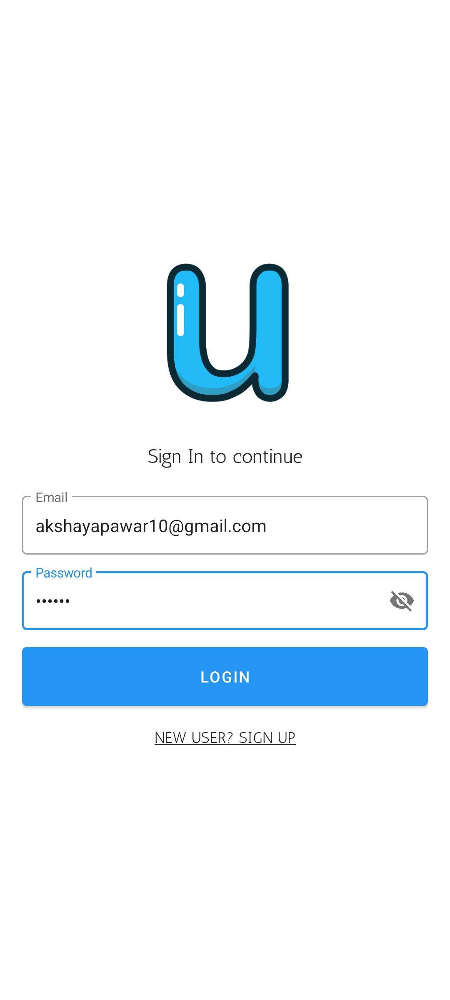
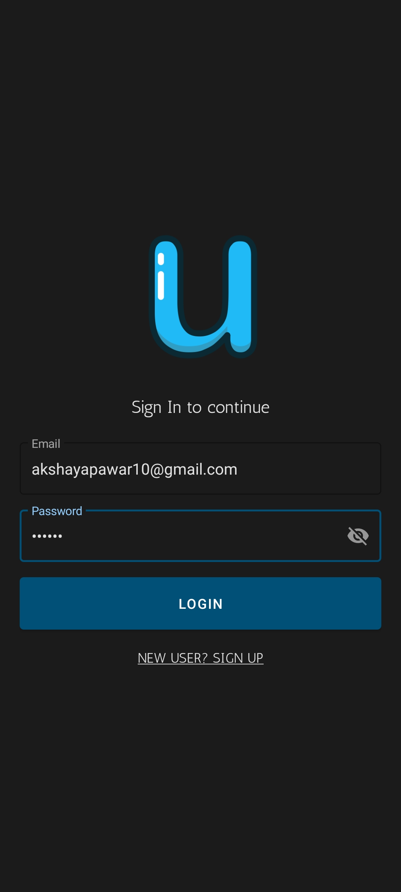
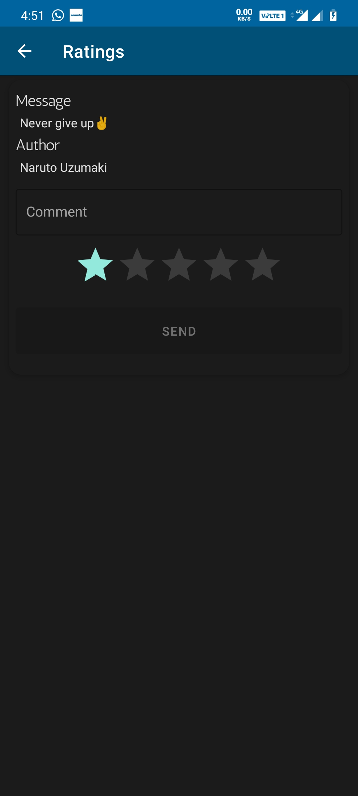
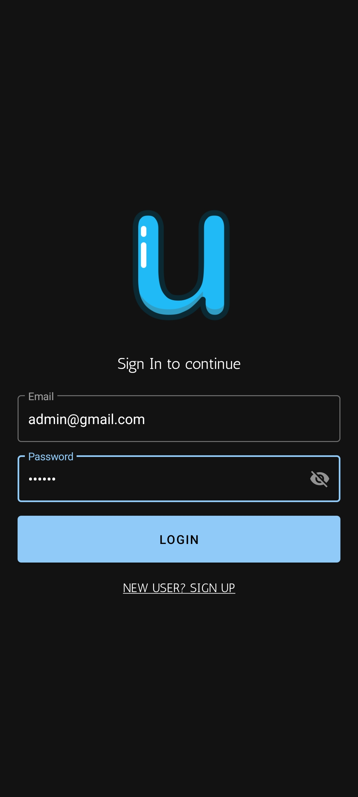
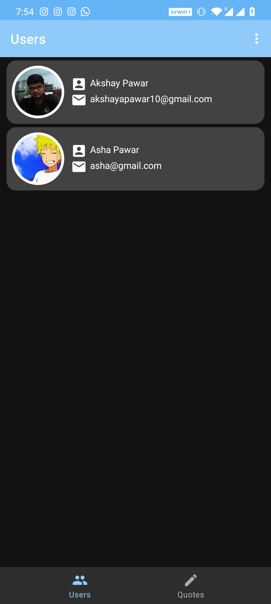
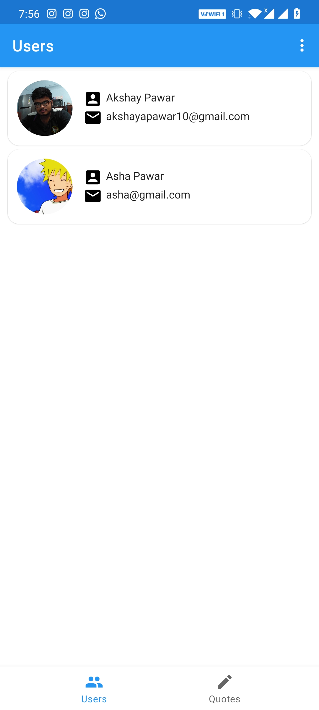
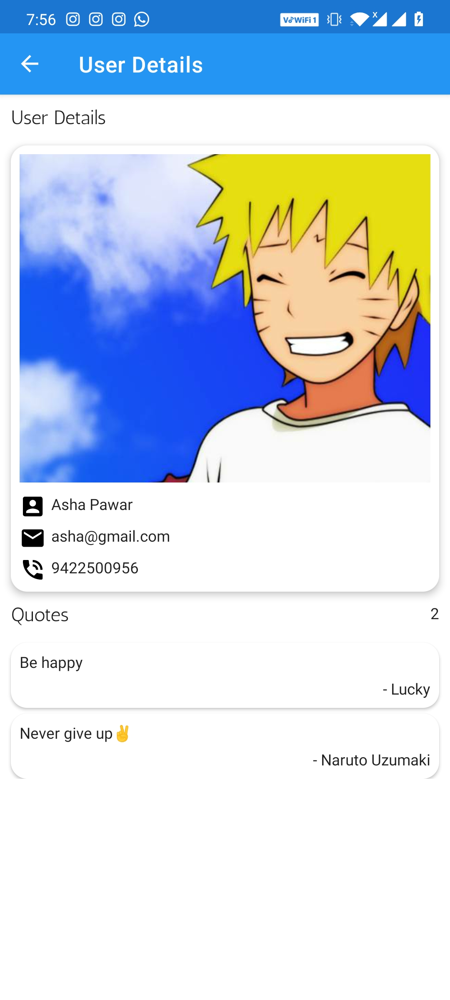

# Userly
Quotes App created with Kotlin, Room Database, Navigation component, Dark mode.

## Table of contents
* [General info](#general-info)
* [What I learnt](#what-i-learnt)
* [Technologies](#technologies)
* [Screenshots](#screenshots)

## General Info
Users - Users can login and register into app. After login user set their profile like upload profile photo, update their personal informartion.
User can see number of quotes, they can read those quotes and give ratings to those quotes and comment their thoughts on that quotes.
User can change app theme from app settings (Dark/Light).

Admin - Admin can login into app. Use this credential email-id = admin@gmail.com and password = 123123.
Admin can add daily quotes, update or delete quotes.
Admin can see users list who've registered in their app, by clicking on users list, admin can see the personal information such as profile photo, contact and quotes list on which user have commented and gave ratings.

## What I learnt
* During this project development i have learned Navigation component. 
* Learned How to adapt Dark theme in your app.
* Learned new Android Architecture Component such as Livedata, Viewmodel, Room persistance library.

## Technologies
The project is created with:
* Android studio : 4.0
* Backend : Kotlin : 1.3.41
* frontend : Material Design (xml).

## Screenshots

